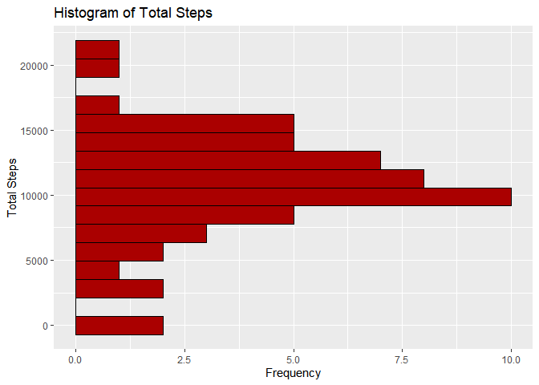
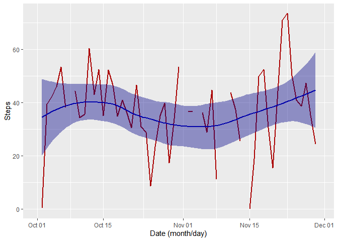
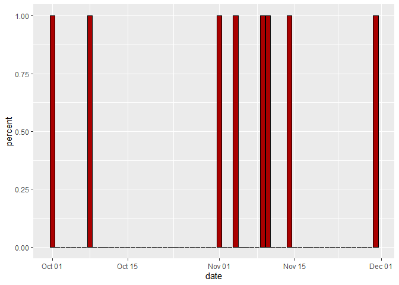
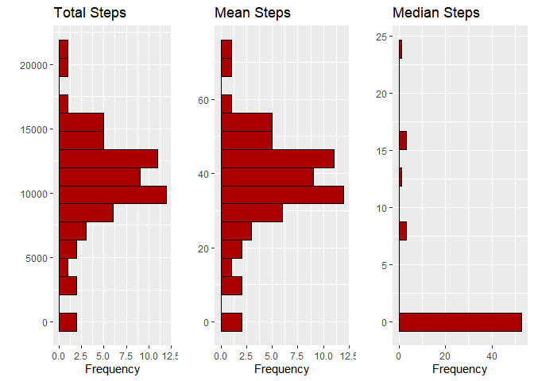
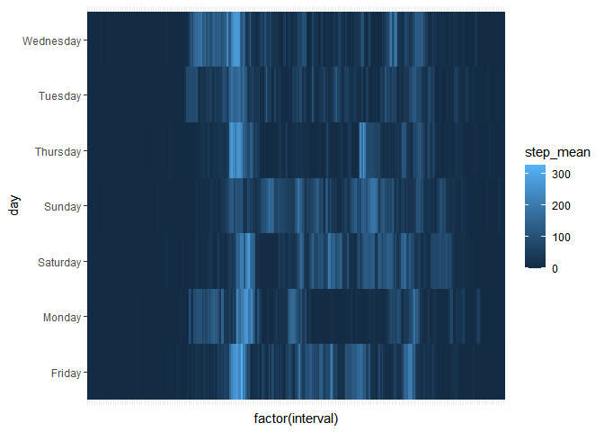

```r
library(dplyr)
library(ggplot2)
library(gridExtra)
library(timeDate)
```

## Loading and preprocessing the data

```r
data <- read.csv(unzip('activity.zip','activity.csv'))
data$date <- as.Date(data$date,"%Y-%m-%d")
data$day <- weekdays(data$date)
```
## What is mean total number of steps taken per day?

```r
sumData <- data %>% group_by(date) %>% summarise(sum=sum(steps))
plot <- ggplot(sumData,aes(y=sum)) + geom_histogram(col="#000000", fill="#aa0000",bins=16)
plot <- plot + labs(title = "Histogram of Total Steps")
plot <- plot + labs(x = 'Frequency')
plot <- plot + labs(y = 'Total Steps')
print(plot)
```

<!-- -->


## What is the average daily activity pattern?

```r
meanData <- data %>% group_by(date) %>% summarise(mean=mean(steps))
plot <- ggplot(data=meanData,aes(x=date,y=mean))
plot <- plot + geom_line(color = "#aa0000", size = 1)
plot <- plot + stat_smooth(color = "#0000aa", fill = "#000088",method = "loess")
plot <- plot + labs(y = 'Steps')
plot <- plot + labs(x = 'Date (month/day)')
print(plot)
```

<!-- -->

## Imputing missing values
### See what the missing values look like,  entire days are missing.

```r
missingData <- data %>% group_by(date) %>% summarise(missing=sum(is.na(steps)),count=n(),percent=mean(is.na(steps)))
plot <- ggplot(data=missingData,aes(x=date,y=percent))+geom_bar(stat="identity",col="#000000", fill="#aa0000")
print(plot)
```

<!-- -->

### Get the averages by interval and day of week

```r
data <- data %>% 
  group_by(day,interval) %>% 
  mutate(step_mean=mean(steps,na.rm=TRUE)) %>% 
  ungroup() %>% 
  mutate(steps = ifelse(is.na(steps), step_mean, steps))
```

### Check average steps by interval and day, see if there is variation

```r
plot <- ggplot(data, aes(factor(interval),day, fill= step_mean)) + geom_tile() 
plot <- plot + theme(axis.ticks.x=element_blank())
plot <- plot + theme(axis.text.x=element_blank())
print(plot)
```

<!-- -->

### Run the Sum, Mean, and Median plots

```r
aggData <- data %>% group_by(date) %>% summarise(sum=sum(steps),mean=mean(steps),median=median(steps))
plot1 <- ggplot(aggData,aes(y=sum)) + geom_histogram(col="#000000", fill="#aa0000",bins=16)
plot1 <- plot1 + labs(title = "Total Steps")
plot1 <- plot1 + labs(x = 'Frequency')
plot1 <- plot1 + labs(y = '')

plot2 <- ggplot(aggData,aes(y=mean)) + geom_histogram(col="#000000", fill="#aa0000",bins=16)
plot2 <- plot2 + labs(title = "Mean Steps")
plot2 <- plot2 + labs(x = 'Frequency')
plot2 <- plot2 + labs(y = '')

plot3 <- ggplot(aggData,aes(y=median)) + geom_histogram(col="#000000", fill="#aa0000",bins=16)
plot3 <- plot3 + labs(title = "Median Steps")
plot3 <- plot3 + labs(x = 'Frequency')
plot3 <- plot3 + labs(y = '')


grid <- grid.arrange(plot1,plot2,plot3,nrow=1)
```

<!-- -->

```r
print(grid)
```

```
## TableGrob (1 x 3) "arrange": 3 grobs
##   z     cells    name           grob
## 1 1 (1-1,1-1) arrange gtable[layout]
## 2 2 (1-1,2-2) arrange gtable[layout]
## 3 3 (1-1,3-3) arrange gtable[layout]
```

## Are there differences in activity patterns between weekdays and weekends?

```r
data <- data %>% mutate(day_type = ifelse(isWeekday(date),"Weekday","Weekend"))
aggData <- data %>% group_by(day_type,interval) %>% summarise(mean=mean(steps,na.rm=TRUE))
plot <- ggplot(data=aggData,aes(x=interval,y=mean))
plot <- plot + geom_line(color = "#aa0000", size = 1) 
plot <- plot + facet_wrap(~ day_type)
plot <- plot + stat_smooth(color = "#0000aa", fill = "#000088",method = "loess")
plot <- plot + labs(y = 'Avg Steps')
plot <- plot + labs(x = 'Interval')
print(plot)
```

<!-- -->
